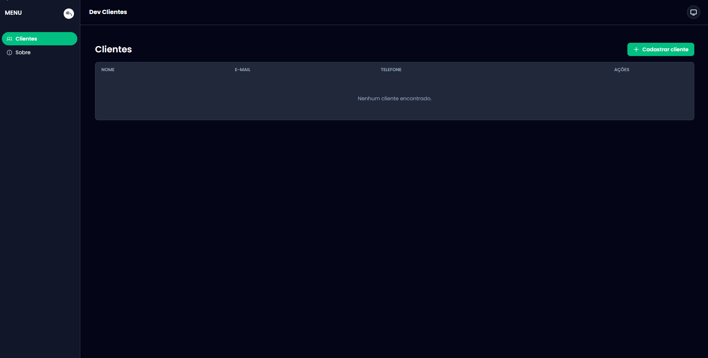

# DevClient

Aplicação desktop para gerenciamento de clientes, desenvolvida com Electron,
React e TypeScript. O projeto utiliza uma arquitetura separada entre os
processos `main`, `preload` e `renderer`, com persistência local dos dados.

<p align="center">
	
</p>

<p align="center"><em>Interface do DevClient com suporte aos modos claro e escuro.</em></p>

## Inicialização e instalação

### Pré-requisitos

- [Node.js](https://nodejs.org/) instalado (versão LTS recomendada)
- [npm](https://www.npmjs.com/), instalado junto com o Node.js

### Instalação

Clone o repositório, acesse a pasta do projeto e instale as dependências:

```bash
git clone <url-do-repositorio>
cd devclient
npm install
```

### Executar em desenvolvimento

Inicie a aplicação em modo de desenvolvimento com atualização automática:

```bash
npm run dev
```

### Verificações e build

Para executar a verificação de tipos e gerar a aplicação:

```bash
npm run typecheck
npm run lint
npm run build
```

Também é possível gerar um instalador para cada sistema operacional:

```bash
npm run build:win
npm run build:mac
npm run build:linux
```

## Tecnologias utilizadas

- **Electron**: criação da aplicação desktop multiplataforma
- **Electron Vite** e **Vite**: desenvolvimento e build da aplicação
- **React** e **React DOM**: construção da interface
- **TypeScript**: tipagem estática e organização do código
- **React Router DOM** e **electron-router-dom**: navegação entre páginas
- **TanStack React Query**: gerenciamento das consultas e mutações
- **PouchDB** e **PouchDB Browser**: persistência local dos dados
- **Tailwind CSS**: estilização responsiva da interface
- **Radix UI**: componentes acessíveis, menus e tooltips
- **Phosphor Icons**: ícones da aplicação
- **React Toastify**: notificações de sucesso e erro nas ações do usuário
- **Electron Builder**: empacotamento e geração dos instaladores
- **ESLint** e **Prettier**: padronização e qualidade do código

## Funcionalidades e melhorias

- Arquitetura do projeto remodelada, com separação entre os processos do
	Electron e organização por responsabilidades.
- Layout da aplicação totalmente remodelado para oferecer uma experiência
	mais clara e consistente.
- Suporte a **light mode** e **dark mode**, com alternância de tema pelo
	usuário.
- Confirmação antes da exclusão de um cliente, evitando remoções acidentais.
- Tooltips nos botões de ações importantes para tornar os controles mais
	claros e acessíveis.
- Cadastro, consulta, visualização de detalhes e exclusão de clientes.
- Alertas de sucesso e erro nas ações de cadastro e exclusão de clientes,
	utilizando o React Toastify.

## Sobre o projeto

Este projeto foi criado durante o treinamento **Criação de Aplicações
Profissionais com Electron**, ministrado por **Matheus Fraga**. Durante o
desenvolvimento, a estrutura e a interface foram remodeladas para aplicar
práticas de organização, usabilidade e construção de aplicações desktop
profissionais.

## Ferramentas recomendadas

- [Visual Studio Code](https://code.visualstudio.com/)
- [ESLint para VS Code](https://marketplace.visualstudio.com/items?itemName=dbaeumer.vscode-eslint)
- [Prettier para VS Code](https://marketplace.visualstudio.com/items?itemName=esbenp.prettier-vscode)
